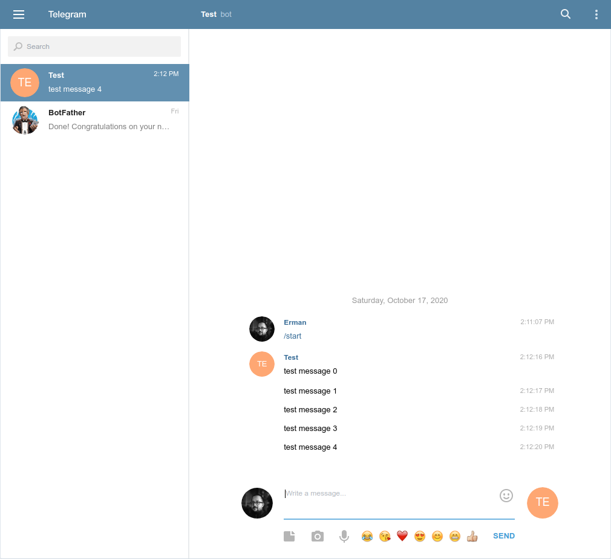

# telegram_bot
Go Telegram Bot


[](https://goreportcard.com/report/github.com/ermanimer/telegram_bot)

## Features
telegram bot sends message to active telegram chats. Telegram bots can be created with [botfather](https://t.me/botfather).

## Usage
Create a bot with [botfather](https://t.me/botfather) and get a token.

### Telegram Commands:
- /start: Actives chat. 
- /stop: Deactivates chat.

### Sample Code:
```go
package main

import (
	"time"

	l "github.com/ermanimer/logger"
	tb "github.com/ermanimer/telegram_bot"
)

func main() {
	//create new bot with your token and updating interval
	b := tb.NewBot("your_token", 1000)
	//listen bot's output
	go func() {
		for o := range b.Output {
			if o.InfoMessage != "" {
				l.Info(o.InfoMessage)
				continue
			}
			if o.ErrorMessage != "" {
				l.Error(o.ErrorMessage)
			}
		}
	}()
	//start bot
	b.Start()
	//send test messages
	for i := 0; i < 10; i++ {
		time.Sleep(1 * time.Second)
		b.SendMessagef("test message %v", i)
	}
	//stop bot
	b.Stop()
}
```

## Screen Shot

